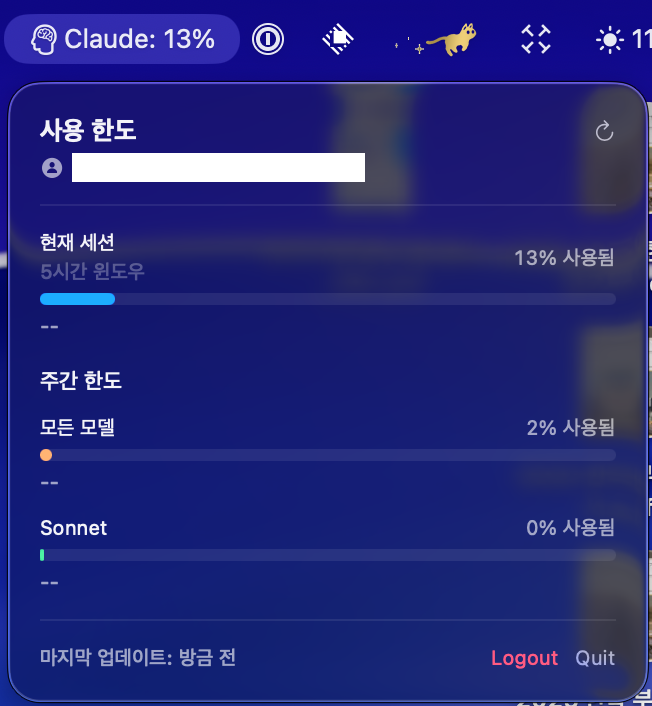
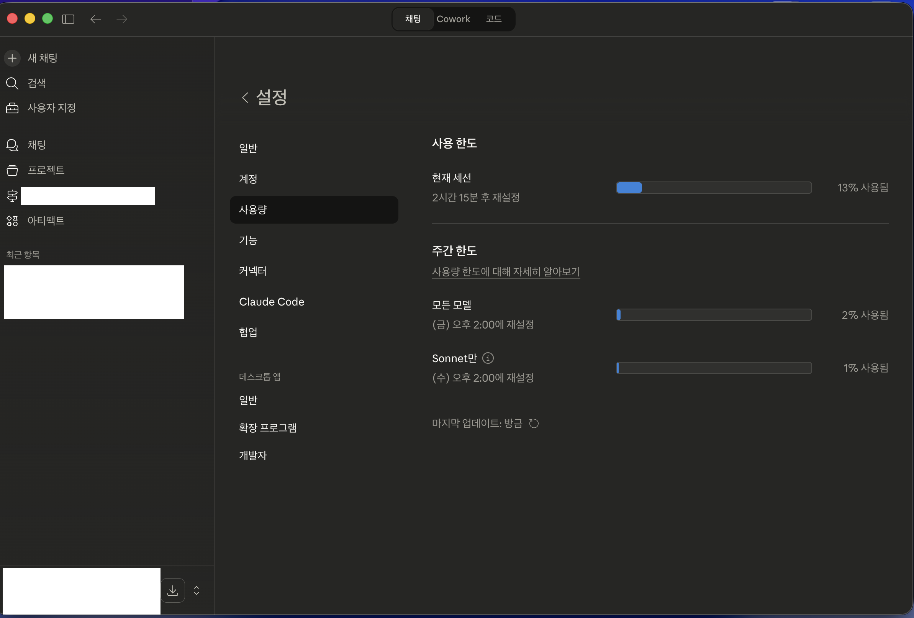

# Claude Usage Tracker

🇺🇸 [English Version](README.md)

Claude AI 사용량 한도를 macOS 상단바에 실시간으로 표시하는 메뉴 바 앱입니다. Claude Desktop 설정 화면에서 확인하던 사용량을 언제든 한눈에 볼 수 있습니다.

[](https://github.com/devsungmin/claude-usage-tracker/releases/latest)
[](https://github.com/devsungmin/claude-usage-tracker/releases/latest)

---

## 다운로드

> **[📥 최신 버전 다운로드](https://github.com/devsungmin/claude-usage-tracker/releases/latest)**

| 파일 | 설명 |
|------|------|
| `ClaudeUsageTracker-vX.X.X.dmg` | DMG 설치 파일 (Applications로 드래그) |
| `ClaudeUsageTracker-vX.X.X.zip` | 앱 번들 ZIP |

---

## 스크린샷

| Claude Usage Tracker | Claude Desktop 설정 |
|:---:|:---:|
|  |  |

---

## 주요 기능

- 📊 **실시간 사용량 표시** — 네 가지 지표 중 하나를 메뉴 바에 표시 (예: `5h: 42%`, `7d: 15%`):
  - 5시간 세션 사용량 %
  - 7일 주간 사용량 % (모든 모델)
  - 7일 주간 사용량 % (Sonnet만)
  - 7일 주간 사용량 % (Opus만)
- 🔐 **Claude Code 자동 연결** — macOS Keychain 또는 `~/.claude/.credentials.json`에서 OAuth 토큰 자동 읽기
- 🔑 **Session Key 로그인** — claude.ai 세션 쿠키를 직접 입력하여 로그인 (형식 검증: `sk-ant-sid01-`)
- 📈 **팝오버 대시보드** — 메뉴 바 아이콘 좌클릭 시 애니메이션 진행 바로 모든 사용량 한도 확인
- 🖱️ **우클릭 메뉴** — 새로고침, 설정, 로그아웃, 종료에 빠르게 접근
- 🌐 **영어 / 한국어** — 앱 내 언어 선택 (시스템 기본값, English, 한국어)
- ⚙️ **설정 가능** — 표시할 지표 선택, 새로고침 간격 설정 (1분 / 5분 / 15분), 로그인 시 자동 실행
- 🔒 **안전한 저장** — 자격 증명은 macOS Keychain에 보관 (`WhenUnlockedThisDeviceOnly`), 입력값 새니타이징, 에러 메시지 정제

---

## 작동 방식

### API

Claude Desktop 앱과 동일한 엔드포인트를 호출합니다:

```
GET https://claude.ai/api/organizations/{orgId}/usage
```

응답:

```json
{
  "five_hour": { "utilization": 2.0, "resets_at": "2026-03-21T18:00:00Z" },
  "seven_day": { "utilization": 1.0, "resets_at": "2026-03-24T00:00:00Z" },
  "seven_day_opus": { "utilization": 0.0 },
  "seven_day_sonnet": { "utilization": 0.5, "resets_at": "2026-03-24T00:00:00Z" }
}
```

### OAuth 폴백

사용량 엔드포인트를 사용할 수 없는 경우, Messages API의 rate-limit 헤더에서 데이터를 읽습니다:

```
anthropic-ratelimit-unified-5h-utilization: 0.02
anthropic-ratelimit-unified-7d-utilization: 0.01
```

---

## 지원 요금제

| 요금제 | 지원 | 비고 |
|--------|------|------|
| **Pro** | Yes | 5시간 세션 + 7일 주간 한도 |
| **Max** | Yes | 더 높은 한도, 동일 데이터 |
| **Team** | Yes | 조직 단위 한도 |
| **Enterprise** | Yes | 커스텀 한도 |
| Free | No | 사용량 엔드포인트 미제공 |
| API (종량제) | No | console.anthropic.com 빌링 사용 |

---

## 요구 사항

- macOS 13 Ventura 이상
- [Claude Code](https://docs.anthropic.com/en/docs/claude-code) **또는** [claude.ai](https://claude.ai) 계정 (Pro / Max / Team / Enterprise)

---

## 설치

### Homebrew (권장)

```bash
brew install --cask devsungmin/tap/claude-usage-tracker
```

### 다운로드

1. **[Releases](https://github.com/devsungmin/claude-usage-tracker/releases/latest)** 페이지로 이동
2. `ClaudeUsageTracker-vX.X.X.dmg` 다운로드
3. DMG를 열고 **ClaudeUsageTracker**를 Applications로 드래그
4. Applications에서 실행 — 메뉴 바에 앱이 나타남

### 소스에서 빌드

```bash
git clone https://github.com/devsungmin/claude-usage-tracker.git
cd claude-usage-tracker
open ClaudeUsageTracker.xcodeproj
```

**⌘R**로 빌드 및 실행.

### macOS Gatekeeper 안내

이 앱은 Apple 공증을 받지 않았습니다. 처음 실행 시 macOS가 차단할 수 있습니다:

1. **시스템 설정** → **개인정보 보호 및 보안**
2. 차단된 앱 메시지를 찾아 스크롤
3. **"확인 없이 열기"** 클릭

최초 1회만 필요합니다.

---

## 사용 방법

### 방법 1 — Claude Code (권장)

Claude Code가 설치되어 있고 로그인된 상태라면, **"Claude Code에서 자동 연결"** 버튼을 클릭하세요. macOS Keychain 또는 `~/.claude/.credentials.json`에서 OAuth 토큰을 자동으로 읽어옵니다.

### 방법 2 — Session Key

1. 브라우저에서 [claude.ai](https://claude.ai)에 로그인합니다.
2. 개발자 도구 → Application → Cookies → `claude.ai`로 이동합니다.
3. `sessionKey` 값을 복사합니다 (`sk-ant-sid01-`로 시작).
4. 앱에 붙여넣고 **Login**을 클릭하거나 **Enter**를 누릅니다.

---

## 프로젝트 구조

```text
ClaudeUsageTracker/
├── AppDelegate.swift              - NSStatusItem, NSPopover, 우클릭 메뉴, 설정 창
├── ClaudeUsageTracker.swift       - @main 앱 진입점
├── Models/
│   ├── TokenUsage.swift           - UsageData, UsageLimit (5h/7d/opus/sonnet)
│   └── UserSettings.swift         - 표시 모드, 새로고침 간격, 로그인 시 자동 실행
├── Services/
│   ├── KeychainService.swift      - Keychain CRUD + Claude Code 인증 읽기 + 입력 검증
│   └── AnthropicAPIService.swift  - claude.ai /usage API + OAuth 폴백 + 헤더 새니타이징
├── ViewModels/
│   └── AppViewModel.swift         - 상태 관리, 자동 새로고침, 에러 정제
└── Views/
    ├── LoginView.swift            - 인증 화면 (Claude Code + Session Key)
    ├── MenuBarPopoverView.swift   - 애니메이션 진행 바 대시보드
    └── SettingsView.swift         - 설정 창 (표시 모드, 간격, 자동 실행)
```

---

## 기술 스택

- **SwiftUI** + **NSStatusItem** / **NSPopover** (macOS 13+)
- **Security.framework** — Keychain 접근
- **ServiceManagement** — 로그인 시 자동 실행
- **URLSession** — HTTP 요청 (TLS 1.2+ 적용)

---

## 라이선스

[MIT 라이선스](LICENSE)

---

> 이 프로젝트는 Anthropic과 공식적인 제휴 관계가 없으며 Anthropic의 공식 지원을 받지 않습니다.
